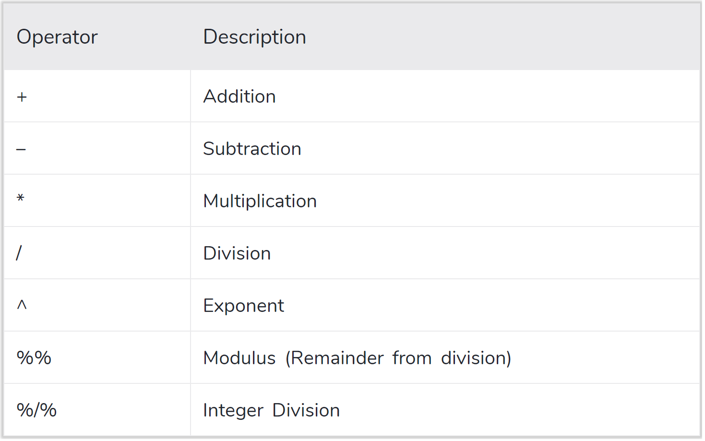
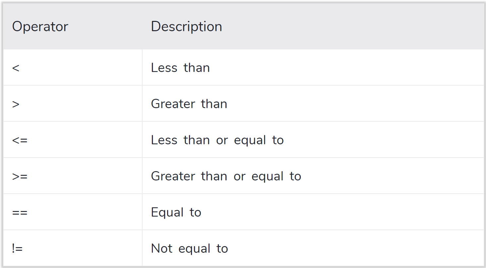
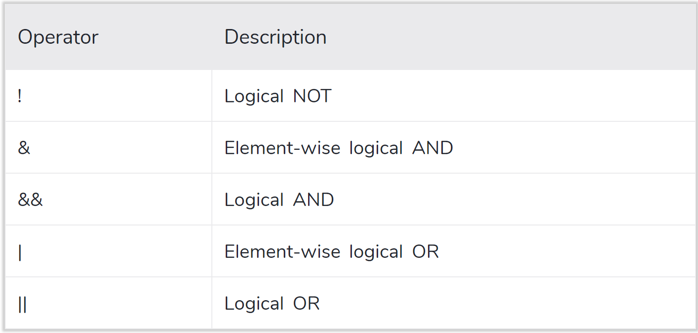

```{r include=FALSE}
knitr::opts_chunk$set(echo = TRUE, message = FALSE, warning = TRUE,
                      comment = "#>")


```


```{r packages, include=FALSE, echo=FALSE}

#install.packages("tidyquant")
#install.packages('gganimate')
#install.packages('gifski')
#install.packages('png')
#install.packages('gapminder')
library(knitr)
library(tidyverse)
library(png)
library(gifski)
library(gganimate)
library(tidyquant)
library(purrr)
library(gapminder)

wrap_rmd(file = 'Lec1.Rmd', width = 15)
```

class:
inverse,
center,
middle

# R Markdown - Quick Overview

---

## R Markdown
R
Markdown
is a
format
that
enables
easy
creation
of
dynamic
documents,
presentations,
and
reports
from
R.
It
combines
the
core
syntax
of
markdown
(an
easy-to-write
plain
text
format)
with
embedded
R
code
chunks
that
are
run
so
their
output
can
be
included
in
the
final
document.
<br>
*Source:
https://support.rstudio.com/hc/en-us/articles/205368677-R-Markdown-Dynamic-Documents-for-R*


### Important things to consider

* Check out the R Markdown cheat sheet!
  https://rstudio.com/wp-content/uploads/2016/03/rmarkdown-cheatsheet-2.0.pdf

* Also the guide to R Markdown
  https://bookdown.org/yihui/rmarkdown/

---

## R Markdown

**R
Markdown
is
part
of
the
R
package
"knitr".
It
allow
to
the
following
(among
other
things):**

.pull-left[
* Create notebooks in which you can directly run code chunks interactively.
* Make slides for presentations.
* Build interactive applications (See Shiny apps).
]

.pull-right[
* Write journal articles.
* Author books of multiple chapters.
* Generate websites and blogs
]


* **Some terminology**
  + knit
  + render
  + code chunk

* **Hoy key to create a code chunk**: `Ctrl + Alt + I`

* **Hot key to "knit" a document**:   `Ctrl + Shift + K`


---

## R Markdown

* **Some important "chunk options"**
<br><br>
  + `include = FALSE` prevents code and results from appearing in the finished file. R Markdown still runs the      code in the chunk, and the results can be used by other chunks.

  + `echo = FALSE` prevents code, but not the results from appearing in the finished file. This is a useful way     to embed figures.

  + `message = FALSE` prevents messages that are generated by code from appearing in the finished file.

  + `warning = FALSE` prevents warnings that are generated by code from appearing in the finished file.

  + `eval = FALSE` code chunk is not evaluated.

  + `error = TRUE` The default is FALSE. This option prevents R Markdown to stop rknitting when there is an         error in the code chunk.

---

class:
inverse,
center,
middle
# R Programming Basics

---

### R as a Calculator

```{r}

1 / 200 * 30

(59 + 73 + 2) / 3

sin(pi / 2)

2^3

```

---

### The assignment operator

* Think about it this way: **"Object 'A' gets value"**
* Hotkey for the *assignment operator*: **Alt + - (the minus sign)**

```{r, eval = FALSE}

# object_name <- value

A <- c(1,2,3,4,5)

```

### Other things that can make your life easier

* RStudio's completion facility (automcompletes): **TAB**

* List all the commands you have already typed: **Cmd/Ctrl + ↑**

* The "pipe" operator. Specially useful for dplyr functions (more of this later): **Ctrl + Shift + m**

* The `help()` function (and google) are your best friends!

---

### Generate deterministic sequences

```{r}

z <- seq(from = 1, to = 5, by = 1)
z

```


### Generate random numbers

```{r}

#From a Uniform distribution

runif(1)
runif(4)
runif(3, min=0, max=100)
```

---

### More random numbers

```{r}

#From a Uniform distribution

sample(1:100, 3, replace=TRUE)
sample(1:100, 3, replace=FALSE)

#From a Normal distribution

rnorm(4)
rnorm(4, mean=50, sd=10)

```

---

### Histogram from random normal simulations

```{r fig.align="center", fig.width=7, fig.height=6}
x <- rnorm(400, mean=50, sd=10)
hist(x)

```

---

### Set a seed to make results reproducible (same randomly generated numbers)
```{r}
set.seed(42)
u1 <- runif(30)
u1

set.seed(42)
u2 <- runif(30)
u2

```

---

class:
inverse,
center,
middle
# Vectors
---

## Vectors

The
fundamental
building
block
of
data
in R
is a
vector


.middle.center[


]

*Source*:
https://r4ds.had.co.nz/vectors.html

---

### Atomic vectors


R
has
four
**main**
atomic
vector
types:

.center[
`logical`,
`double`,
`integer`,
`character`
]


```{r}
x <- c(T, F, TRUE, FALSE)
typeof(x)

y <- c("Go", "Devils")
typeof(y)
```

---

### Concatenation

Construct
vectors
with
`c()`

```{r}

c(1, 2, 3, 4, 5)

c(c(3, 4), c(10, TRUE))

a <- c("Brazil", "Bolivia")
b <- c("Peru", "Ecuador", "Argentina", c("Venezuela", "Chile"))
c <- c(a,b)

c


```

---

Coercion
hierarchy:
**character
-->
double
-->
integer
-->
logical**
```{r results='hide'}
x <- c(T, 5, F, 0, 1)
y <- c("a", 1, T)
z <- c(3.0, 4L, 0L)

```

--
.pull-left[
```{r}
x
y
z
```
]

.pull-right[
```{r}
typeof(x)
typeof(y)
typeof(z)
```
]

---

Cocatenate
character
vectors
to
get
strings
with
**`str_c`**

```{r}

r <- ("Go")
s <- ("Devils")

aa <- str_c(r,s,"!")
aa

bb <- str_c(r,s,"!", sep = " ")
bb

cc <- str_c(r," ", s, "!")
cc

dd <- str_c(str_c(r, s, sep = " "), "!")
dd
```
---

class:
inverse,
center,
middle

# Lists
##(Recursive vectors)

---

## Lists

* A step up in complexity. Suitable for representing hierarchical or tree-like structures.

* We will not be using this data structure in the course but is useful to know what they are. Large and more complex data sets usually come in the form of a hierarchical structure (For example JSON format).

* You create a list with `list()`:

```{r}

x <- list(1, 2, 3, "Fuqua", "Duke")
x

```

---

## Lists

A
very
useful
function
to
explore
lists
is
`str()`.
It
focus
on
the
structure
and
not
in
the
contents.
For
example,
we
can
see
how
nested
a
list
is.

```{r}

str(x)

z <- list(list(1, 2), list(3, 4))
str(z)

```

---
class:
inverse,
center,
middle
# Data Frames

---

## Data Frames

.pull-left[

* Data frames are built on top of lists with attributes: names, row.names, and class. Here the class is data.frame.
* Data frames are rectangular in structure
  ]

.pull-right[

* Can be heterogeneous across columns
* They can have column names and row names
* can be subset by name or position
  ]

**Lets
check
a
data-frame
of
macroeconomic
data
(*"Longley's
Economic
Regression
Data"*)**
```{r}
head(longley)
```
---
## Data Frames

```{r}

typeof(longley)  # Dataframes are lists! (with attributes)

attributes(longley)

```

---

### Creating Data Frames

```{r}
# Primitive way - From a list

x <- list(c("Time Series", "Corporate Finance", "Derivatives"),
          c(35, 41, 21),
          c(4, 4, 2))
str(x)

# We add attributes (class, col names and row names)

attributes(x) <- list(class = "data.frame",
                      names = c("course", "numb_students", "weekly_hours"),
                      row.names = 1:3)
str(x)

```

---
### Creating Data Frames

```{r}

# Using R base function 'data.frame()'

y <- data.frame(course = c("Time Series", "Corporate Finance", "Derivatives"),
                numb_students = c(35, 41, 21),
                weekly_hours = c(4, 4, 2))
str(y)

# Note that 'data.frame()' converts the characters (strings) to factors. We can control that with 'stringsAsFactors = FALSE'.

z <- data.frame(course = c("Time Series", "Corporate Finance", "Derivatives"),
                numb_students = c(35, 41, 21),
                weekly_hours = c(4, 4, 2),
                stringsAsFactors = FALSE)

str(z)

```

---
class:
inverse,
center,
middle
# Data Manipulation with **Base R**
## Operators and Subsetting
---

## Operators

### Arithmetic Operators

.middle.center[



]

*Source*:
https://www.datamentor.io/r-programming/operator/

---

### Arithmetic Operators

```{r}

#Examples

5/2 # Floating division

5%/%2 # Integer division

5%%2  # Modulus (remainder)

```
---


### Relational Operators (Comparison)

.middle.center[



]

*Source*:
https://www.datamentor.io/r-programming/operator/

---

### Relational Operators (Comparison)

```{r}

#Examples

x <- c(4, 10, -5)
y <- c(0, 51, 9 / 5)
z <- c("four", "for", "4")

x > y
x != y
x == z
x %in% z

```

---

**Concept
of
"Vectorization"**:
Most
of
the
mathematical
operators
are
vectorized
in R
as
well
as
many
functions
built-in
to
R.

```{r}

a <- c(0, 1.5, sqrt(30))
b <- c(1, 2, 7)

#All these operations are "vectorized"

a ^ b
exp(a / b)
rnorm(n = 3, mean = a, sd = b) # Generate random normal values

```

---

### Logical Operators (Boolean)

.middle.center[



]

*Source*:
https://www.datamentor.io/r-programming/operator/

---

### Logical Operators (Boolean)

```{r}

x <- c(T, F, T, T)
y <- c(F, F, T, F)

!x
x | y
x & y

```

---
## Data Manipulation
### Subsetting with Base R

There
are
three
operators
for
subsetting:
`[`,
`[[`,
`$`

```{r}

x <- c("NC", "CA", "WA", "NY")                                                  #We create a vector
y <- list(states = x, rank = 1:4, message = "These are my favorite states")     #We put it in a list with two other components

x; y

```
---

### Subsetting with Base R

```{r}
x[-c(2.2, 3.9)]

#Logical Subsetting
x <- c(1, 4, 7, 12)
x[c(TRUE, TRUE, FALSE, TRUE)]

x[c(TRUE, FALSE)]

x[x %% 2 == 0]

#Character Subsetting (by name)
x  <- c(a = 1, b = 4, c = 7)
x["a"]


```

---

### Subsetting with Base R

**Now
lets
try
with
the
'$'
operator**
```{r}

#Lets use the data-frame "z" we created before

z <- data.frame(course = c("Time Series", "Corporate Finance", "Derivatives"),
                numb_students = c(35, 41, 21),
                weekly_hours = c(4, 4, 2),
                stringsAsFactors = FALSE)

students <- z$numb_students

hours <- z$weekly_hours

```

---
class:
inverse,
center,
middle
# Data Manipulation with **dplyr**
## (part of the tidyverse package)
---

### Package **`tidyverse`**

.middle.center[


]

*Source*:
https://flipboard.com/@becomingdatasci/data-science-related-tutorials-1h97ri85z

---

### Data Manipulation with **`dplyr`**

* Check out the `dplyr` cheatsheet [here](http://dtg.usc.edu/tgrn510/wp-content/uploads/2017/09/data-transformation-cheatsheet.pdf)

* It is also worth checking the Data Wrangling cheatsheet (involves `dplyr` and `tidyr`) [here](https://rstudio.com/wp-content/uploads/2015/02/data-wrangling-cheatsheet.pdf)

* We will use the 'mtcars' built-in data set for this section

* This is an old data set from 1974 on gasoline consumption for various car models

* For more information type `?mtcars` in the console. For example, there we can see what the variables are.

* Most common (and useful) dplyr functions are:
  + **`select()`**
  + **`filter()`**
  + **`arrange()`**
  + **`mutate()`**
  + **`summarise()`**
  + **`group_by()`**

---
### Data Manipulation with **`dplyr`**

**`Select()`**
```{r}

#Lets use the mtcars data set (built-in)
head(mtcars)

# Keep only two columns (variables): miles per galon and weight.
cars_0 <- select(mtcars, c(mpg, wt))
head(cars_0)

```

---

**`Select()`**
```{r}

# Same but using the pipe operator
cars_0 <- mtcars %>% select(c(mpg, wt))
head(cars_0)

# Note that the car model is not one variable in the data frame but the names of the rows.
str(cars_0)
```

```{r results='hide'}
# Type the following in your console
rownames(cars_0)

```

---

### Data Manipulation with **`dplyr`**

**`arrange()`**
```{r}

# Reorder the data set by weight (ascending order is the default)
cars_1 <- cars_0 %>% arrange(wt)
head(cars_1)

# In descending order
cars_1 <- cars_0 %>% arrange(desc(wt))
head(cars_1)

```

---

### Data Manipulation with **`dplyr`**

**`filter()`**
```{r}

# Lets keep only the data points that follow a certain rule (filter). For example, we may want to keep only the cases where the weight is above 3,000 pounds.
cars_2 <- cars_1 %>% filter(wt>3)
head(cars_2)
nrow(cars_2)
nrow(cars_1)

```

---

**`filter()`**
```{r}

# Now lets get only the cases where the weight is exactly 3.440 thousand pounds
cars_3 <- cars_1 %>% filter(wt==3.440)
head(cars_3)

# Me might want to keep only the cases where the weight is below the average of the sample.
cars_4 <- cars_1 %>% filter(wt < mean(mtcars$wt))
head(cars_4)
nrow(cars_4)

```

---

### Data Manipulation with **`dplyr`**

**combining
`dplyr`
functions**
```{r}
# We can combine dplyr functions like this
cars_5 <- mtcars %>%
  select(c(mpg, cyl, disp, wt)) %>%
  filter(mpg < mean(mpg))
head(cars_5)

```
---
### Data Manipulation with **`dplyr`**

**`summarize()`**
```{r}
# Summarize creates a new summary variable for one variable.
cars_6 <- mtcars %>%
  summarise(mean_wt = mean(wt), n = n())
head(cars_6)

# Usually we combine 'summarize' with 'group_by' to do descriptive analysis between groups
cars_7 <- mtcars %>%
  group_by(cyl) %>%
  summarise(mean_wt = mean(wt), sd_wt = sd(wt), n = n())
```
---
### Data Manipulation with **`dplyr`**

**`mutate()`**

```{r}

# Mutate allows to create another column with some transformation of one or more of the existing variables. For example lets codify as 1 all the observations where weight is above average and 0 all that are below.

mtcars_2 <- mtcars %>%
  mutate(wt_dummy = ifelse(wt < mean(mtcars$wt), 0, 1))

head(mtcars_2)

```


---
class:
inverse,
center,
middle

# Conditional Control Flow
## (If Statements and For Loops)

---

## If Statements

```{r eval=FALSE}
if (condition) {
  # code to run
  # when condition is
  # TRUE
}
```

**Some
Examples**
```{r}

if (1 > 0) {
  print("Yes, 1 is greater than 0.")
}


x <- c(1, 2, 3, 4)
if (3 %in% x) {
  print("Yes, 3 is in x.")
}

```

---

## If Statements

**Note
that
`if`
is
not
vectorized.
`ifelse`
is!**
```{r}

if (x == T) {
  1                       #See warning message: This means that "if" is not vectorized!
} else {0}

ifelse(c(F, T, T),         # ifelse is vectorized!
       1, 0)

```

---

## If Statements

**More
examples
with
`ifelse`**
```{r}
z <- c(-4:-1, 1:3)
z
ifelse(test =z < 0, yes = "neg", no = "pos")  #We can put the arguments directly without specifying their names like "test", "yes" and "no".


x <- rnorm(n = 4, mean = 0, sd = 1)
x
ifelse(test = abs(x) > 3, yes = "outlier", no = "no outlier")

```

---

## Nested Conditionals

```{r}

x = 0

if (x < 0) {
  "Negative"
} else if (x > 0) {
  "Positive"
} else {
  "Zero"
}

```

```{r}

x = -3

if (x < 0) {
  "Negative"
} else if (x > 0) {
  "Positive"
} else {
  "Zero"
}

```


---

## For Loops
```{r}

k = 0
for (i in c(2, 4, 6, 8)) {
  print(i ^ 2)
  k <- k + i ^ 2
}

```


**Note
that
"automatic
printing"
is
turned
off
inside
loops.**

```{r}
a <- c(2, 4, 6, 8)
a ^ 2               #Automatic printing


k = 0
for (i in c(2, 4, 6, 8)) {
  i ^ 2
  k <- k + i ^ 2
}
```


---

## For Loops

* Keywords for Loops:
    + **`next`**: exits the current iteration
    + **`break`**: exits the inner-most loop

```{r}

for (i in 1:10) {
  if (i %% 2 == 0) {next}
  print(paste("Number ", i, " is odd."))
  if (i %% 7 == 0) {break}
}

```

---

## For Loops

### Iterating over Indices

**You
can
use:
`length()`,
`seq()`,
`seq_along()`,
and
`seq_len()`**

```{r}

4:7

length(4:7)

seq(4, 7, by = 2)

seq_along(4:7)

```
---

### Iterating over Indices

```{r}

#Example
a <- numeric(10)
for (i in seq_len(10)) {
  a[i] <- i ^ 3
}

# For Loops are not always the best approach.
# This is faster:

c(1:10) ^ 3
```
---
class:
inverse,
center,
middle
# Functions
---

## Functions

Most
functions
end
by
returning
a
value
(implicitly
or
explicitly)
or
in
error.

```{r}

#Implicit Return
central_tend <- function(x) {
  c(mean(x), median(x))
}

#Explicit Return
standardize <- function(x) {
  stopifnot(length(x) > 1)
  z <- (x - mean(x)) / sd(x)
  return(z)
}

alfa <- rnorm(200, mean=50, sd=10)

central_tend(alfa)

```

```{r results='hide'}

standardize(alfa) #Run this in your Rmd file. It will return the standardized contents of alfa.

```


---

## Functions

**Calling
a
function:**
involves
the
function's
name
and,
at a
minimum,
values
to
its
required
arguments.

```{r}

mean(x = z, trim = .3, na.rm = FALSE)


data <- rnorm(500, 30, 6)
central_tend(data)

```

---

class:
inverse,
center,
middle

# Visualizations

---

### Simple Plots (base R)

* We'll use the following built-in data sets:

    + **LakeHuron:** Annual measurements of the level, in feet, of Lake Huron 1875–1972. Time Series data

    + **mtcars:** Data was extracted from the 1974 Motor Trend US magazine. It comprises fuel consumption and 10 aspects of automobile design and performance for 32 automobiles (1973–74 models).

    + **iris:** This data gives the measurements in centimeters of the variables sepal length and width and petal length and width, respectively, for 50 flowers from each of 3 species of iris. The species are Iris setosa, versicolor, and virginica.

---

### Simple Plots (base R)

**Line
Plots
-
Different
styles**

```{r fig.show='hold', fig.width=5, fig.height=4}

plot(LakeHuron, type="l", main='type=l')
plot(LakeHuron, type="p", main='type=p')

```

---

### Simple Plots (base R)

**Line
Plots
-
Different
styles**

```{r fig.show='hold', fig.width=6, fig.height=5, fig.align='center'}

plot(LakeHuron, type="b", main='type=b')

```

---

### Simple Plots (base R)

**Scatter
Plot**

```{r fig.width=6, fig.height=5, fig.align='center'}

scatt <- plot(mtcars$mpg, mtcars$disp)

```

---

**Matrix
of
scatter
plots**

```{r fig.width=7, fig.height=6, fig.align='center'}

scatt_mat <-  pairs(iris)

```

---

**Histogram**

```{r fig.width=6, fig.height=5, fig.align='center'}

hist_mpg <- hist(mtcars$mpg)

```

---

### Simple Plots (base R)

**Boxplots**

```{r fig.width=5, fig.height=4, fig.align='center'}

box <- boxplot(mtcars$disp, mtcars$mpg, names = c('disp', 'mpg'))
title('Boxplot')

```

*When
you
are
preparing
a
report
in R
Markdown,
you
can
use
the
`echo
=
FALSE`
parameter
to
prevent
printing
of
the
R
code
that
generated
the
plot.*

---

## ggplot2

**`qplot()`
allows
us
to
create
the
most
common
graph
types
with
`ggplot2`.**

Lets
make
a
graph
of
the
Kernel
Density
of
the
Miles
per
Gallon
data
```{r fig.width=5, fig.height=4, fig.align='center'}
#Using mtcars
qplot(mpg, data=mtcars, geom="density", fill=I('red'), alpha=I(.5),
   main="Distribution of Gas Milage", xlab="Miles Per Gallon",
   ylab="Density")

```


---

## ggplot2

Now
we
create
a
factor
variable
based
on
the
values
of
**gear**
to
generate
a
Kernel
Density
graph
by
groups
```{r fig.width=5, fig.height=4, fig.align='center'}

#We can create factor variables that we can use to do some visualizations by groups
mtcars$gear_fact <- factor(mtcars$gear,levels=c(3,4,5),
   labels=c("3gears","4gears","5gears"))

qplot(mpg, data=mtcars, geom="density", fill=gear_fact, alpha=I(.5),
   main="Distribution of Gas Milage", xlab="Miles Per Gallon",
   ylab="Density")

```

---

## ggplot2

We
generate
a
Boxplot
based
on
the
factor
variable
created.
This
will
produce
a
visualization
by
groups.
```{r fig.width=6, fig.height=5, fig.align='center'}

# Boxplots of mpg by number of gears
qplot(gear_fact, mpg, data=mtcars, geom=c("boxplot", "jitter"),
   fill=gear_fact, main="Mileage by Gear Number",
   xlab="", ylab="Miles per Gallon")

```

---

## ggplot2

* `ggplot()` function is much more flexible than the `qplot()` function and has a lot of options to improve visualization.

* In this section we will use two data sets:

  + Evolution of the *bitcoin price* from https://coinmarketcap.com/

  + Macro data for 142 countries from the `gapminder` package

---

## ggplot2

**Bitcoin**
Time-Series
Plot
```{r Bitcoin, fig.width=4.5, fig.height=3.5, fig.align='center'}

# Load bitcoin historical prices from github
data <- read.table("https://raw.githubusercontent.com/holtzy/data_to_viz/master/Example_dataset/3_TwoNumOrdered.csv", header=T)
data$date <- as.Date(data$date)


data %>%
  ggplot( aes(x=date, y=value)) +
    geom_line(color="blue") +
    ggtitle("Evolution of Bitcoin price") +
    ylab("bitcoin price ($)")

```

---

## ggplot2

Now
we
remove
the
grid
lines
and
add
an
axis
line
```{r fig.width=4.5, fig.height=3.5, fig.align='center'}

data %>%
  ggplot( aes(x=date, y=value)) +
    geom_line(color="blue") +
    ggtitle("Evolution of Bitcoin price") +
    ylab("bitcoin price ($)") +
    theme(panel.grid.major = element_blank(),
          panel.grid.minor = element_blank(),
          axis.line = element_line(size = 0.5, linetype = "solid",
                                   colour = "black"))
```

---

## ggplot2

We
fill
the
area
under
the
line
-
Area
Chart
```{r fig.width=5, fig.height=4, fig.align='center'}

data %>%
  ggplot( aes(x=date, y=value)) +
    geom_area(fill="#69b3a2", alpha=0.5) +
    geom_line(color="#69b3a2") +
    ggtitle("Evolution of Bitcoin price") +
    ylab("bitcoin price ($)")

```

---

We
create
a
graph
that
allows
us
to
compare
the
behaviour
of
the
data
with
respect
to a
certain
threshold
```{r fig.width=5, fig.height=4, fig.align='center'}
# Threshold =  7500
data %>%
  tail(300) %>%
  mutate( mycolor=ifelse(value>7500, "yes", "no")) %>%
  ggplot( aes(x=date, y=value)) +
    geom_ribbon(aes(ymin=7500, ymax=value, fill=mycolor), color="black", alpha=0.5) +
    scale_fill_manual(values=c("#69b3a2","#271569")) +
    ggtitle("Evolution of Bitcoin price") +
    ylab("bitcoin price ($)") +
    theme(legend.position="none")
```

---

## ggplot2

Using
macro-economic
data
from
**Gapminder**
```{r Gapminder}

head(gapminder)

```

---

## ggplot2

```{r fig.width=5, fig.height=4, fig.align='center'}

ggplot(gapminder, aes(x = gdpPercap, y = lifeExp, size = pop, colour = country)) +
  geom_point(alpha = 0.7, show.legend = FALSE) +
  scale_colour_manual(values = country_colors) +
  scale_size(range = c(2, 12)) +
  scale_x_log10() +
  facet_wrap(~continent) +
  theme_bw(base_size = 16)

```

---

## ggplot2

Lets
include
some
animation
using
the
`gganimate`
and
`gifski`
packages
```{r fig.width=4.8, fig.height=3.8, fig.align='center'}

ggplot(gapminder, aes(x = gdpPercap, y = lifeExp, size = pop, colour = country)) +
  geom_point(alpha = 0.7, show.legend = FALSE) +
  scale_colour_manual(values = country_colors) +
  scale_size(range = c(2, 12)) +
  scale_x_log10() +
  facet_wrap(~continent) +
  theme_bw(base_size = 16) +
  labs(title = 'Year: {frame_time}', x = 'GDP per capita', y = 'Life expectancy') +
  transition_time(year) +
  ease_aes('linear')


```

---

##Check out the cheatsheets of the different packages and tools here:

https://rstudio.com/resources/cheatsheets/

---

## References

*https://r4ds.had.co.nz/
*http://www.cookbook-r.com/
*https://www.econometrics-with-r.org/1-1-a-very-short-introduction-to-r-and-rstudio.html
*https://rmarkdown.rstudio.com/index.html
*https://www.ssc.wisc.edu/sscc/pubs/RFR/RFR_RMarkdown.html
*https://shawnsanto.com/teaching/duke/sta523/week1/
*https://www.datamentor.io/r-programming/operator/
*https://www.data-to-viz.com/
